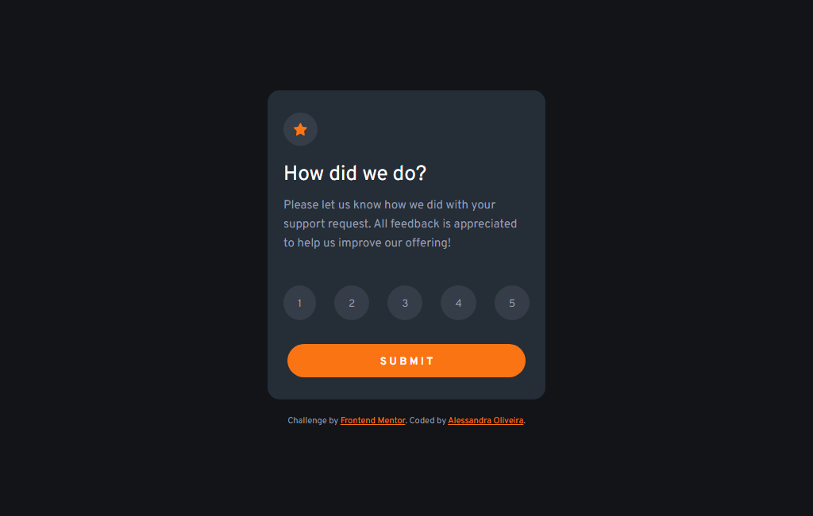

# Frontend Mentor - Interactive Rating Component Solution

This is a solution to the [Interactive rating component challenge on Frontend Mentor](https://www.frontendmentor.io/challenges/interactive-rating-component-koxpeBUmI). 

## Table of contents

- [Overview](#overview)
  - [The challenge](#the-challenge)
  - [Screenshot](#screenshot)
  - [Links](#links)
- [My process](#my-process)
  - [Built with](#built-with)
- [Author](#author)
  
## Overview

This is my solution to the interactive rating component challenge. It was built entirely with HTML, CSS and JavaScript.

### The challenge

Users should be able to:

- View the optimal layout for the app depending on their device's screen size
- See hover states for all interactive elements on the page
- Select and submit a number rating
- See the "Thank you" card state after submitting a rating

### Screenshot

**The main card:** the first thing the users see.

**Thank you card:** what the users see after they rate

### Links

- Solution on Frontend Mentor: [Link](https://www.frontendmentor.io/solutions/interactive-rating-component-solution-B5Gehuiar4)
- Live Site URL: [Link](https://itsale-o.github.io/interactive-rating-component/)

## My process

### Built with

- Semantic HTML5 markup
- CSS custom properties
- Flexbox
- JavaScript

## Author

- Frontend Mentor - [@itsale-o](https://www.frontendmentor.io/profile/itsale-o)
- LinkedIn - [Alessandra Oliveira](https://www.linkedin.com/in/alessandra-santos-oliveira/)
- Twitter - [@itsale_o](https://twitter.com/itsale_o)
